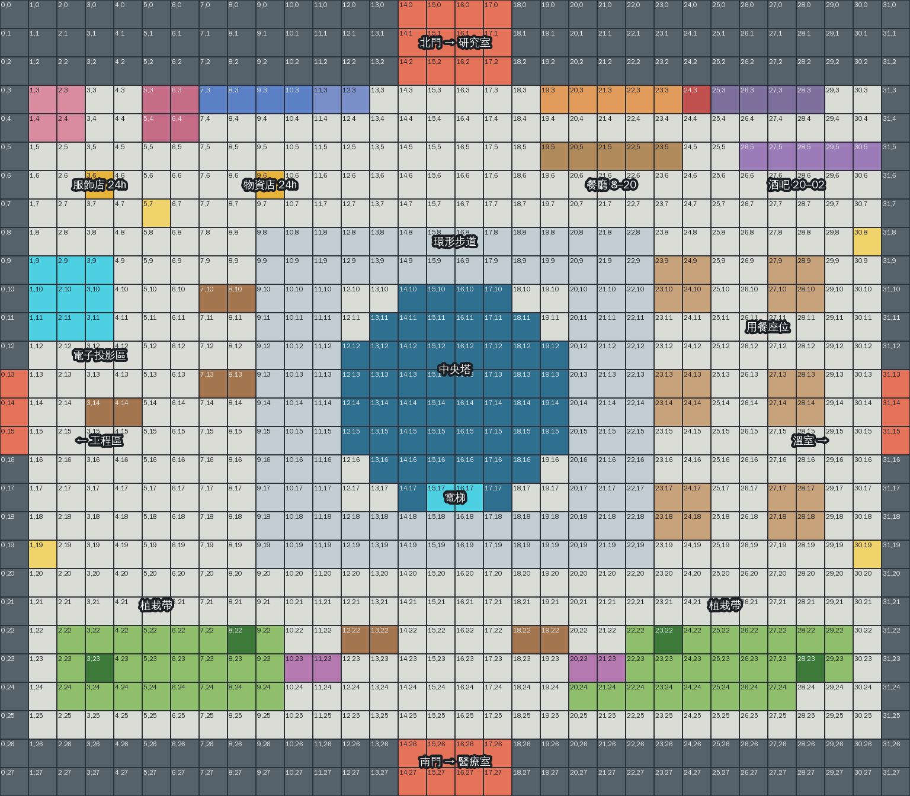

# 中央廣場

星艦正中心的生活聚落（星圖區域 id `park`，星圖上叫「中央公園」，遊戲裡的場景名用「中央廣場」）。中央塔的電梯向上直達艦橋、向下是接駁口，兼貨梯；塔四周是環狀廣場：無人商店、有 NPC 的餐廳與酒吧、用餐座位、電子投影、少許植栽。溫室的收成由玩家推車送到這裡的餐廳（`src/game/supplies.ts`，進場自動卸貨）。

目前進度：**規劃階段**（starport-scene-props 步驟 2）。配置圖與檢查腳本已完成，底圖與物件尚未生圖。

## 分區與動線

依「東西從哪進來、在哪處理、人在哪休息」分區，不照搬溫室或工程區的格局：

- 北牆下沿一排店面（由西到東）：服飾店、物資店（無人，24 小時）｜北門通道｜餐廳（8:00–20:00）、酒吧（20:00–02:00）。餐廳與酒吧相鄰，共用東側的用餐座位，一家打烊另一家開門，吧台前擺高腳凳。無人店靠西，鄰近投影區。
- 正中央是中央塔（圓形，直徑 8 格），電梯門朝南（面向鏡頭）。塔四周一圈 3 格寬的環形步道，四個方向都走得通。
- 西側：電子投影區。投影台貼西牆（3 × 3 格），三張長椅面向它；平常放影片與球賽，開會時投出艦內各區畫面。
- 東側：用餐座位，六張四人桌分三排，緊鄰餐廳與酒吧，桌間走道 2 格寬。
- 南側：植栽帶。兩塊草地各兩棵樹（沿用溫室的樹與花叢素材）、中間兩座花台與兩張長椅；南門在正中間。
- 四個門洞：北門往研究室（lab）、西門往工程區（engineering）、東門往溫室（greenhouse）、南門往醫療室（medical），對應星圖 `connectedTo`。艦橋走中央塔電梯，不是門洞。

數字：32 × 28 格（每格 96 px，3072 × 2688 px）；第 0–2 列北牆立面、26–27 列南牆；室內可走比例 0.79。

## 物件清單（規劃）

| 區 | 物件 | 佔地（格） | 高矮 | 互動 | 備註 |
|---|---|---|---|---|---|
| 中央 | 中央塔 | 圓形直徑 8 | 高（蓋過角色） | 電梯門：上艦橋／下接駁口 | 一件一張；只畫塔基與下段，頂部用光環或截斷收掉 |
| 服飾店 | 展示衣架 ×2 | 2 × 1 各 | 中 | 看 | 靠北牆 |
| 服飾店 | 試衣艙 | 2 × 2 | 高 | 看 | 鏡面投影 |
| 服飾店 | 自助終端 | 1 × 1 | 矮 | 結帳（24h） | |
| 物資店 | 自動販賣牆 | 4 × 1 | 高 | 看 | 缺貨格亮橘燈 |
| 物資店 | 取貨櫃 | 2 × 1 | 高 | 看 | |
| 物資店 | 自助終端 | 1 × 1 | 矮 | 結帳（24h） | |
| 餐廳 | 廚房出餐口 | 5 × 1 | 高（牆面） | — | NPC 站櫃台後 |
| 餐廳 | 櫃台 | 5 × 1 | 矮 | 點餐（8–20） | 主餐、副餐、湯品 |
| 餐廳 | 菜單看板 | 1 × 1 | 高 | 看 | |
| 酒吧 | 後吧酒架 | 4 × 1 | 高（牆面） | — | |
| 酒吧 | 吧台 | 5 × 1 | 矮 | 點單（20–02） | 酒精、飲料、甜點 |
| 酒吧 | 高腳凳 ×5 | 不擋路 | 矮 | 坐 | decor，吧台前 |
| 用餐 | 四人桌 ×6 | 2 × 2 各 | 矮 | 坐 | 椅子不擋路 |
| 投影 | 電子投影台 | 3 × 3 | 矮（台）＋投影 | 看 | 投影走特效層 |
| 投影 | 長椅 ×3 | 2 × 1 各 | 矮 | 坐 | 南側植栽帶再 ×2 |
| 植栽 | 樹 ×4、花叢、花台 ×2 | 樹幹 1 格、花台 2 × 1 | — | — | 樹與花沿用 `public/assets/greenhouse/props/` |
| 共用 | 立燈 ×4 | 1 × 1 | 高 | — | 廣場四角 |

擺設參考圖分四批（每張最多 9 種物件）：(1) 服飾店＋物資店、(2) 餐廳＋酒吧、(3) 中央塔＋投影區、(4) 用餐區＋植栽帶的花台、長椅、立燈。

## 營業時間

`src/game/shopHours.ts`：`SHOPS` 列四家店與時段，`isOpen(hours, 'HH:MM')` 只看小時（跟 NPC 日程同精度），酒吧跨午夜；`shopStatus()` 給互動提示與 GM 摘要用。測試 `shopHours.test.ts` 驗證餐廳與酒吧時段剛好接上、不同時開，02–08 兩家都休息。場景做好後再接到櫃台互動與 NPC 日程。

## 檔案

- 規劃腳本：`tools/art/plaza_plan.py`（LAYOUT 字母格；改配置重跑），輸出 `tools/art/plaza/plaza_reference.png` 與 `plaza_plan.json`（collision、entrances、interactions、shops，以及給 `facility_ground.py` 用的 terrain：P 淺色鋪面、W 步道、G 草地）。
- 檢查：連通（四個門洞與所有站位走得到）、死路、一格窄道（只剩餐廳與酒吧櫃台後的走道，刻意保留給 NPC）。

## 下一步

1. 底圖（只有地面）。建議沿用溫室的材質與 `facility_ground.py`：P → edge（淺色鋪面）、W → walkway、G → lawn，不用新生材質；北牆立面與左右牆照工程區的做法由程式畫（商業娛樂區配色：霧面白金屬、青藍燈條、少量霓虹點綴）。另一個做法是請 Codex 整張生成地面，但接縫與格線對位比較難控。
2. 擺設參考圖四批（Codex，prompt 範本見 `.claude/skills/starport-scene-props/SKILL.md`），先給使用者看配置與 prompt 再送。
3. 最終物件、切圖、`tools/art/plaza_objects.py`（照 `engineering_objects.py` 格式），`plaza_build.py` 產 `public/assets/plaza/`，`FACILITIES` 加 `park`，`facilityContext.ts` 補中文名。
4. 待定：餐廳與酒吧由哪位 NPC 顧店（接 `npcSchedule`）；電梯互動的介面（上艦橋直接切場景、接駁口暫時只給提示）；接駁口要不要做場景。
